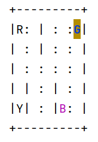

# RL-Learning

学习强化学习的笔记 

## 已实现的方法
+ DQN
+ Sarsa
+ Q-Learning
## 方法展示
#### Sarsa

训练环境: Gym Taxi-v3
<table><tr>
<td></td>
<td></td>
<td></td>
</tr></table>

#### Q-Learning
训练环境: Gym Taxi-v3
<table><tr>
<td></td>
<td></td>
<td></td>
</tr></table>

